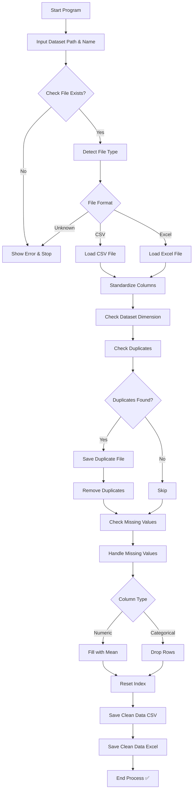

## 🏗️ Data Cleaning System Architecture (Enterprise-Style)

```mermaid
flowchart LR

%% INPUT LAYER
A[User Input<br/>Path & Dataset Name] --> B[File Validation Module]

%% VALIDATION
B --> C{File Exists?}
C -- No --> D[Error Handler<br/>Stop Process ❌]
C -- Yes --> E[File Type Detection]

%% INGESTION LAYER
E --> F{Data Source}
F -- CSV --> G[CSV Loader Engine]
F -- Excel --> H[Excel Loader Engine]
F -- Unknown --> D

G --> I[Data Ingestion Layer]
H --> I

%% PROCESSING LAYER
I --> J[Data Standardization<br/>Column Formatting]
J --> K[Data Profiling Module]

K --> L[Duplicate Detection Engine]
L --> M{Duplicates Found?}
M -- Yes --> N[Duplicate Storage Layer<br/>Export Duplicates]
N --> O[Duplicate Removal Engine]
M -- No --> P[Skip]

O --> Q[Missing Value Analyzer]
P --> Q

Q --> R[Data Cleaning Engine]

%% CLEANING LOGIC
R --> S{Column Type Check}
S -- Numeric --> T[Imputation Engine<br/>Fill with Mean]
S -- Categorical --> U[Row Filtering Engine<br/>Drop NA Rows]

T --> V[Data Integrity Layer]
U --> V

%% OUTPUT LAYER
V --> W[Index Reset & Final Structuring]
W --> X[Export Engine]

X --> Y[Clean Data (CSV)]
X --> Z[Clean Data (Excel)]

Y --> AA[Process Completed ✅]
Z --> AA
```

---

## 🧠 System Explanation

This system is designed as a modular data cleaning pipeline, similar to enterprise data processing workflows:

### 🔹 Input Layer
Handles user input and validates dataset path before processing begins.

### 🔹 Ingestion Layer
Supports multiple data sources (CSV & Excel) and ensures flexible data loading.

### 🔹 Processing Layer
Performs:
- Data standardization  
- Data profiling  
- Duplicate detection & removal  

### 🔹 Cleaning Engine
Applies intelligent cleaning strategies:
- Numeric data → imputed using mean  
- Categorical data → filtered to maintain data integrity  

### 🔹 Output Layer
Generates:
- Clean dataset (CSV & Excel)  
- Duplicate dataset (for audit purposes)  

---

## 🚀 Why This Design Matters

- Mimics real-world **data pipeline architecture**  
- Ensures **scalability & reusability**  
- Separates logic into clear modules  
- Demonstrates understanding beyond coding → **system thinking**  

---

⭐ *This architecture reflects how data cleaning processes are structured in real-world data engineering and analytics workflows.*# 🐍 Data Cleaning Master | Python Project

## 📊 Project Overview

**Project Title**: Data Cleaning Master  
**Level**: Beginner – Intermediate  
**Language**: Python  

This project is designed to automate the data cleaning and preprocessing process using Python. It transforms raw datasets into clean, structured, and analysis-ready data by handling common data quality issues such as missing values, duplicates, and inconsistent formats.

---

## 🎯 Objectives

- Automate data cleaning workflow  
- Validate dataset file and format  
- Handle missing values and duplicates  
- Standardize dataset structure  
- Generate clean datasets for further analysis  

---

## 🔄 Data Cleaning Workflow (Visual)



---

## 🛠 Project Structure

### 1. File Validation & Loading

- Detect dataset format (CSV / Excel)  
- Validate file path  
- Handle parsing errors  

```python
if not os.path.exists(data_path):
    print('File not found.')
```

---

### 2. Data Standardization

- Convert all column names to lowercase for consistency  

```python
data.columns = [col.lower() for col in data.columns]
```

---

### 3. Data Exploration

- Check dataset dimensions  
- Identify duplicate records  
- Analyze missing values  

---

### 4. Data Cleaning

#### 🔁 Duplicate Handling

- Detect duplicate rows  
- Save duplicate records  
- Remove duplicates  

```python
data = data.drop_duplicates()
```

---

#### ❗ Missing Value Handling

- Numeric columns → filled with mean  
- Categorical columns → rows removed  

```python
if data[col].dtype in (float, int):
    data[col] = data[col].fillna(data[col].mean())
else:
    data.dropna(subset=[col], inplace=True)
```

---

### 5. Data Finalization

- Reset index after cleaning  

```python
data = data.reset_index(drop=True)
```

---

### 6. Output Generation

- Save cleaned dataset into:
  - CSV file  
  - Excel file  

```python
data.to_csv(f"{data_name}_Clean_data.csv", index=None)
data.to_excel(f"{data_name}_Clean_data.xlsx", index=None)
```

---

## 🔍 Key Features

- Automated data cleaning process  
- Supports CSV and Excel files  
- Detects and removes duplicates  
- Handles missing values intelligently  
- Generates clean datasets automatically  
- User-friendly execution  

---

## 💡 Key Insights

- Raw datasets often contain duplicates and missing values that reduce data quality  
- Automated cleaning improves efficiency and reduces manual effort  
- Clean data is essential for accurate analysis in tools like SQL and Power BI  

---

## 🛠 Skills Demonstrated

- Python Programming  
- Data Cleaning & Preprocessing  
- Pandas & NumPy  
- File Handling  
- Error Handling  
- Automation  

---

## 🚀 Tools & Libraries

- Python  
- Pandas  
- NumPy  
- OpenPyXL / xlrd  
- OS & File Handling  

---

## ▶️ How to Run

1. Run the script:

```bash
python your_script_name.py
```

2. Input:
- Dataset path  
- Dataset name  

3. Output:
- Cleaned dataset (CSV & Excel)  
- Duplicate dataset file (if exists)  

---

## 📂 Dataset

- Supports:
  - CSV files  
  - Excel (.xlsx) files  
- Works with structured datasets  

---

## 📊 Conclusion

This project demonstrates how Python can be used to automate data cleaning processes efficiently. It highlights the importance of preprocessing in data analytics and shows how raw data can be transformed into reliable and analysis-ready datasets.

---

## 👤 Author

**Rajiv Noor Said**  
Industrial Engineering Graduate | Aspiring Data Analyst  

🔗 LinkedIn:  
www.linkedin.com/in/rajiv-noor-said  

---

⭐ *This project showcases my ability to automate data cleaning and prepare high-quality datasets for analysis.*
